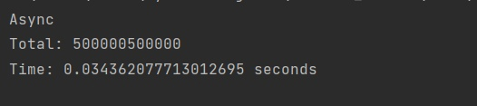
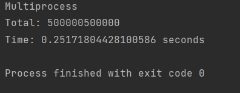
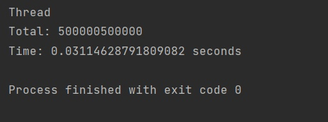
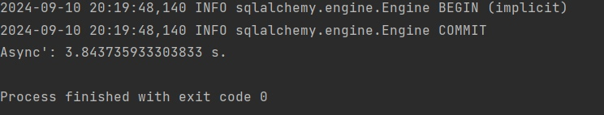
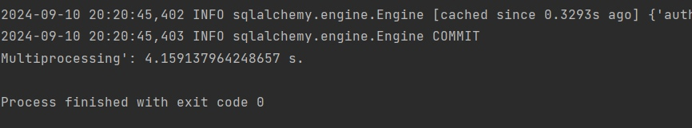
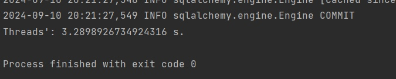

# Лабораторная работа №2

Цель работы: понять отличия перечисленных понятий.

## Задача №1

Задача: Напишите три различных программы на Python, использующие каждый из подходов: threading, multiprocessing и async. Каждая программа должна решать считать сумму всех чисел от 1 до 1000000. Разделите вычисления на несколько параллельных задач для ускорения выполнения.

Подробности задания:

Напишите программу на Python для каждого подхода: threading, multiprocessing и async.
Каждая программа должна содержать функцию calculate_sum(), которая будет выполнять вычисления.
Для threading используйте модуль threading, для multiprocessing - модуль multiprocessing, а для async - ключевые слова async/await и модуль asyncio.
Каждая программа должна разбить задачу на несколько подзадач и выполнять их параллельно.
Замерьте время выполнения каждой программы и сравните результаты.

## Ход выполнения работы

### asnc.py:
    import asyncio
    import time
    
    async def calculate_sum(start, end):
        return sum(range(start, end))
    
    async def main():
        tasks_quantity = 4
        numbers = 1000000
        step = numbers // tasks_quantity
    
        tasks = [asyncio.create_task(calculate_sum(i * step + 1, (i + 1) * step + 1)) for i in range(tasks_quantity)]
        results = await asyncio.gather(*tasks)
        total = sum(results)
        print(f"Total: {total}")
    
    if __name__ == "__main__":
        print("Async")
        start_time = time.time()
        asyncio.run(main())
        end_time = time.time()
        print(f"Time: {end_time - start_time} seconds")

### mlt.py:
    import multiprocessing
    import time
    
    def calculate_sum(start, end):
        return sum(range(start, end))
    
    def worker(args):
        start, end = args
        return calculate_sum(start, end)
    
    def main():
        tasks_quantity = 4
        numbers = 1000000
        step = numbers // tasks_quantity
        tasks = []
        with multiprocessing.Pool(processes=tasks_quantity) as pool:
            for i in range(tasks_quantity):
                start = i * step + 1
                end = (i + 1) * step + 1
                tasks.append((start, end))
            results = pool.map(worker, tasks)
            total = sum(results)
            print(f"Total: {total}")
    
    if __name__ == "__main__":
        print("Multiprocess")
        start_time = time.time()
        main()
        end_time = time.time()
        print(f"Time: {end_time - start_time} seconds")
### thr.py:
    import threading
    import time
    
    def calculate_sum(start, end):
        return sum(range(start, end))
    
    def worker(start, end, results, index):
        results[index] = calculate_sum(start, end)
    
    def main():
        tasks_quantity = 4
        numbers = 1000000
        step = numbers // tasks_quantity
        threads = []
        results = [None] * tasks_quantity
        for i in range(tasks_quantity):
            start = i * step + 1
            end = (i + 1) * step + 1
            thread = threading.Thread(target=worker, args=(start, end, results, i))
            threads.append(thread)
            thread.start()
        for thread in threads:
            thread.join()
        total = sum(results)
        print(f"Total: {total}")
    
    if __name__ == "__main__":
        print("Thread")
        start_time = time.time()
        main()
        end_time = time.time()
        print(f"Time: {end_time - start_time} seconds")

## Результат

## Задача №2

Напишите программу на Python для параллельного парсинга нескольких веб-страниц с сохранением данных в базу данных с использованием подходов threading, multiprocessing и async. Каждая программа должна парсить информацию с нескольких веб-сайтов, сохранять их в базу данных.

Подробности задания:

Напишите три различных программы на Python, использующие каждый из подходов: threading, multiprocessing и async.
Каждая программа должна содержать функцию parse_and_save(url), которая будет загружать HTML-страницу по указанному URL, парсить ее, сохранять заголовок страницы в базу данных и выводить результат на экран.
Используйте PostgreSQL или другую базу данных на ваш выбор для сохранения данных.
Для threading используйте модуль threading, для multiprocessing - модуль multiprocessing, а для async - ключевые слова async/await и модуль aiohttp для асинхронных запросов.
Создайте список нескольких URL-адресов веб-страниц для парсинга и разделите его на равные части для параллельного парсинга.
Запустите параллельный парсинг для каждой программы и сохраните данные в базу данных.
Замерьте время выполнения каждой программы и сравните результаты.

## Ход выполнения работы

### asnc.py:
    async def parse_and_save(url, db_pool):
        try:
            async with aiohttp.ClientSession(connector=aiohttp.TCPConnector(ssl=False)) as session:
                async with session.get(url) as response:
                    r = await response.text()
                    soup = BeautifulSoup(r, 'html.parser')
                    vinils = soup.find_all('div', class_="album")
                    for vinil in vinils:
                        try:
                            name = vinil.find('div', class_='album_cont').find('h4', class_='album_title').find('a')
                            start_author = str(name).find('>') + 1
                            end_author = str(name).find('<br')
                            author = str(name)[start_author:end_author].strip()
                            start_album = str(name).find(' ') + 5
                            end_album = str(name).find('</a')
                            album_title = str(name)[start_album:end_album].strip()
                            cost = vinil.find('div', class_='album_footer').find('div', class_='price').get_text().strip()
                            await db_pool.fetch(QUERY_1, author, album_title, cost)
                        except Exception:
                            print("Проблемы с чтением альбома")
        except Exception:
            print("Проблемы с чтением каталога")
### mlt.py
    import multiprocessing
    import time
    import requests
    from bs4 import BeautifulSoup
    
    from db.db import init_db, s
    from db.models import Vinil
    from db.url import urls
    
    
    def parse_and_save(queue,url):
        r = requests.get(url)
        soup = BeautifulSoup(r.text, 'html.parser')
        vinils = soup.find_all('div', class_="album")
        for vinil in vinils:
            try:
                name = vinil.find('div', class_ = 'album_cont').find('h4', class_ = 'album_title').find('a')
                start_author = str(name).find('>') + 1
                end_author =str(name).find('<br')
                author = str(name)[start_author:end_author].strip()
                start_album = str(name).find(' ') + 5
                end_album = str(name).find('</a')
                album_title = str(name)[start_album:end_album].strip()
                cost = vinil.find('div', class_ = 'album_footer').find('div', class_ = 'price').get_text().strip()
                queue.put((author, album_title, cost))
            except Exception:
                pass
        queue.put(None)
    
    if __name__ == '__main__':
        init_db()
        start_time = time.time()
        queue = multiprocessing.Queue()
        processes = []
        for url in urls:
            process = multiprocessing.Process(target=parse_and_save,args=(queue, url))
            processes.append(process)
            process.start()
        len_proc = len(urls)
        while len_proc>0:
            data = queue.get()
            if data is None:
                len_proc = len_proc - 1
            else:
                author, album_title, cost  = data[0], data[1], data[2]
                vinil = Vinil(name=album_title, cost = cost, author=author)
                s.add(vinil)
                s.commit()
        end_time = time.time()
        print(f"Multiprocessing': {end_time - start_time} s.")
### thr.py
    import threading
    import time
    import requests
    from bs4 import BeautifulSoup
    from db.db import s, init_db
    from db.models import Vinil
    from db.url import urls
    
    lock = threading.Lock()
    
    def parse_and_save(url):
        r = requests.get(url)
        soup = BeautifulSoup(r.text, 'html.parser')
        vinils = soup.find_all('div', class_="album")
        for vinil in vinils:
            try:
                name = vinil.find('div', class_ = 'album_cont').find('h4', class_ = 'album_title').find('a')
                start_author = str(name).find('>') + 1
                end_author =str(name).find('<br')
                author = str(name)[start_author:end_author].strip()
                start_album = str(name).find(' ') + 5
                end_album = str(name).find('</a')
                album_title = str(name)[start_album:end_album].strip()
                cost = vinil.find('div', class_ = 'album_footer').find('div', class_ = 'price').get_text().strip()
                lock.acquire()
                vin = Vinil(name = album_title, author = author, cost = cost)
                s.add(vin)
                s.commit()
                lock.release()
            except Exception:
                pass
    
    if __name__ == '__main__':
    
        init_db()
        start_time = time.time()
        threads = []
        for url in urls:
            thread = threading.Thread(target=parse_and_save, args=(url,))
            threads.append(thread)
            thread.start()
        for thread in threads:
            thread.join()
        end_time = time.time()
        print(f"Threads': {end_time - start_time} s.")
## Результат

