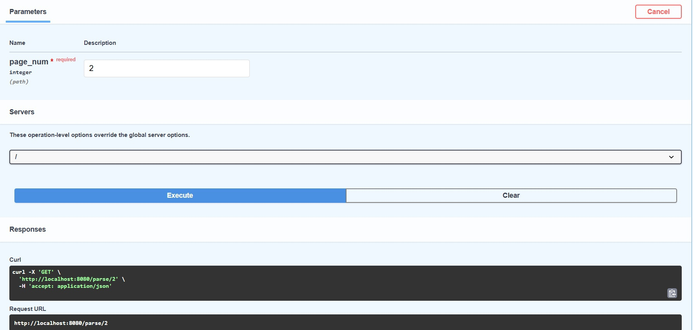
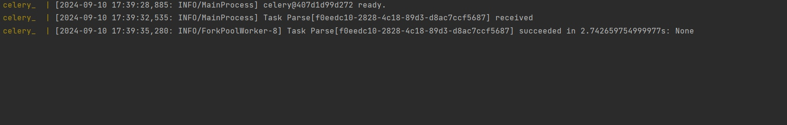

# Лабораторная работа №3

## Код docker-compose.yml
    version: "3.9"
    
    services:
      db:
        image: postgres:15
        container_name: db_
        command: -p 1221
        expose:
          - 1221
        env_file:
          - .env
      redis:
        image: redis:7
        container_name: redis_
        command: --port 5370
        expose:
          - 5370
      app:
        build:
          context: .
        env_file:
          - .env
        container_name: api_
        depends_on:
          - db
          - redis
        ports:
          - 8080:8080
      celery:
        build:
          context: .
        container_name: celery_
        env_file:
          - .env
        command: ["/lab_3/docker/celery.sh"]
        depends_on:
          - app
          - redis
          - db

## Код Dockerfile
    FROM python:3.11
    
    WORKDIR /lab_3
    
    COPY requirements.txt .
    
    RUN pip3 install -r requirements.txt
    
    COPY . .
    
    RUN chmod a+x docker/*.sh
    
    CMD gunicorn main:app --worker-class uvicorn.workers.UvicornWorker --bind 0.0.0.0:8080

## Код vinil_endpoints
    from fastapi import APIRouter
    from worker import parse
    
    vinil_router = APIRouter()
    
    @vinil_router.get("/parse/{page_num}")
    async def parse_vinil(page_num: int):
        url = None
        if page_num == 1:
            url = 'https://vinyl.ru/catalog/'
        if page_num <=5 and page_num > 1:
            url = f'https://vinyl.ru/catalog/?PAGEN_1={page_num}'
        if url:
            parse.delay(url)
            return {"ok": True}

## Код worker.py

    import asyncio
    from celery import Celery
    from sqlalchemy import create_engine
    from sqlalchemy.orm import sessionmaker
    from models.vinil_models import Vinil
    from parsing.parser import parse_and_save
    
    
    import os
    from dotenv import load_dotenv
    
    load_dotenv()
    
    DB_HOST = os.environ.get("DB_HOST")
    DB_PORT = os.environ.get("DB_PORT")
    DB_NAME = os.environ.get("DB_NAME")
    DB_USER = os.environ.get("DB_USER")
    DB_PASS = os.environ.get("DB_PASS")
    
    REDIS_HOST = os.environ.get("REDIS_HOST")
    REDIS_PORT = os.environ.get("REDIS_PORT")
    
    broker = f'redis://{REDIS_HOST}:{REDIS_PORT}'
    worker = Celery('tasks', broker=broker)
    
    DB_URL = f"postgresql://{DB_USER}:{DB_PASS}@{DB_HOST}:{DB_PORT}/{DB_NAME}"
    engine = create_engine(DB_URL)
    Session = sessionmaker(bind=engine)
    db_session = Session()
    
    @worker.task(name='Parse')
    def parse(url: str):
        asyncio.run(parse_and_save(url, DB_URL))

### Результат

